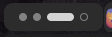

# iWorkspace Indicator

GNOME Shell extension for an **interactive** workspace indicator (GNOME-like).

Forked from https://gitlab.com/null-git/simple-workspaces-bar (which is forked from https://github.com/fthx/workspaces-bar).
